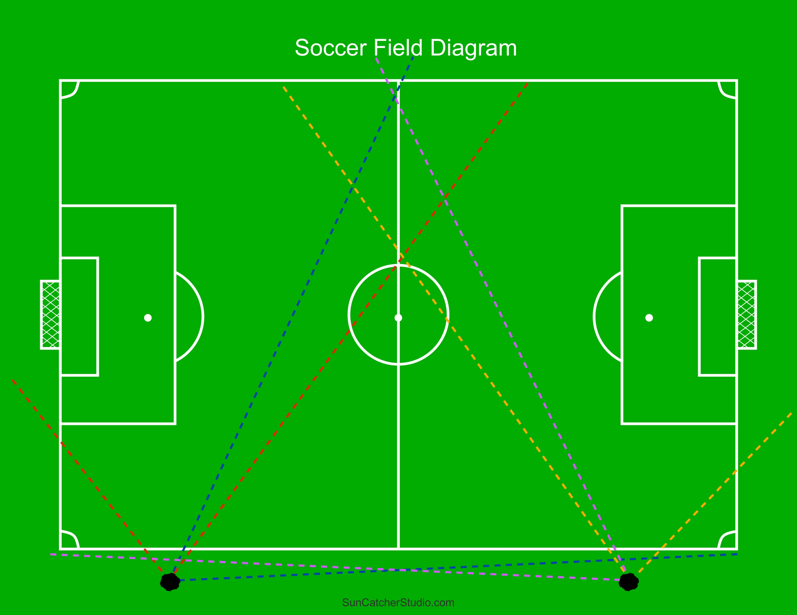

# Recording Soccer

# Diagram

Two tripods, each with two cameras.  Each color shows the approximate field of
view of that camera.

- Set one camera at an angle of 0, and the other camera at an angle of 55 degrees.
- Visualize where the extended 18 yard box line would hit the sideline.  Walk 3 paces
  down the side line towards the center of the field, then turn and walk 5 paces away
  from the field.  Set up the tripod.
- I use a 16 degree downward tilt on the cameras, measured with my phone.

# My Process

- On the Brave 7 LE, I configure as follows:
   - Swipe Down, Swipe Left, Gear Icon
      - Reset, if necessary.
      - Format, if necessary.
      - Video Encoding: H.265
      - General Settings:
         - Turn off auto-shutdown.
         - Date Stamp: On
   - Swipe Up
      - Resolution: 1080P
      - Frame Rate: 30
      - Mode: Loop Mode, 5 Minutes per file
   - Swipe Left
      - "Auto"
      - EV: -1.0
   - Turn on Wifi (tap power button) and connect with the phone app, this syncs the 
     time from the phone to the camera, turn off WiFi.
   - Set the zoom to 1.8.
      - Zooms up to 2.5 work good on the camera facing the center, but more zoom
        starts to cut off parts of the sideline.
- Start the cameras and raise the tripod to full height.  Align the 0 degree camera to
  look straight across the field.  The 55 degree camera should be looking roughly
  towards the center of the field.
- Repeat on the opposite end of the field.
